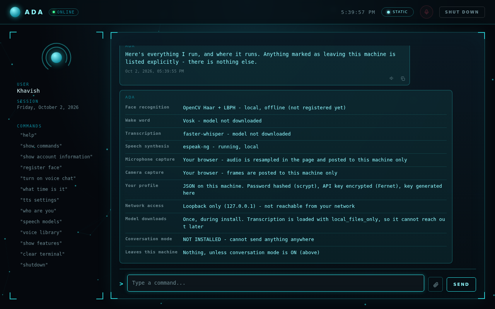
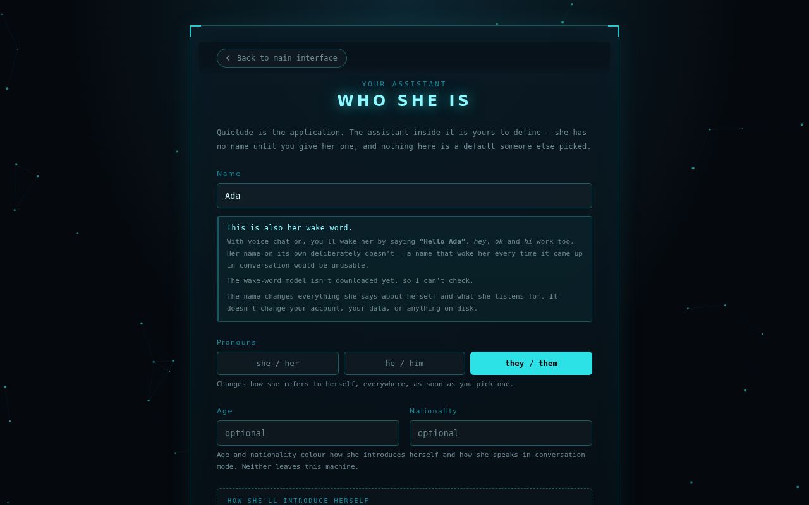
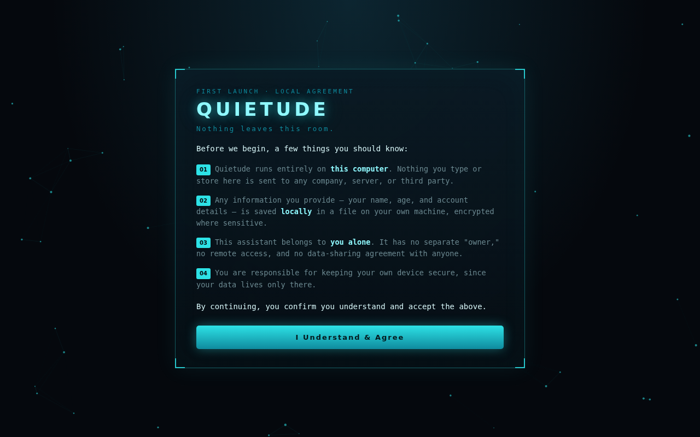
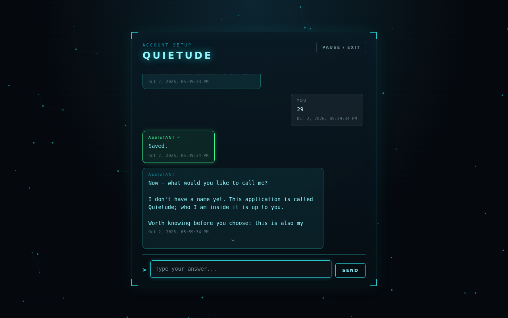
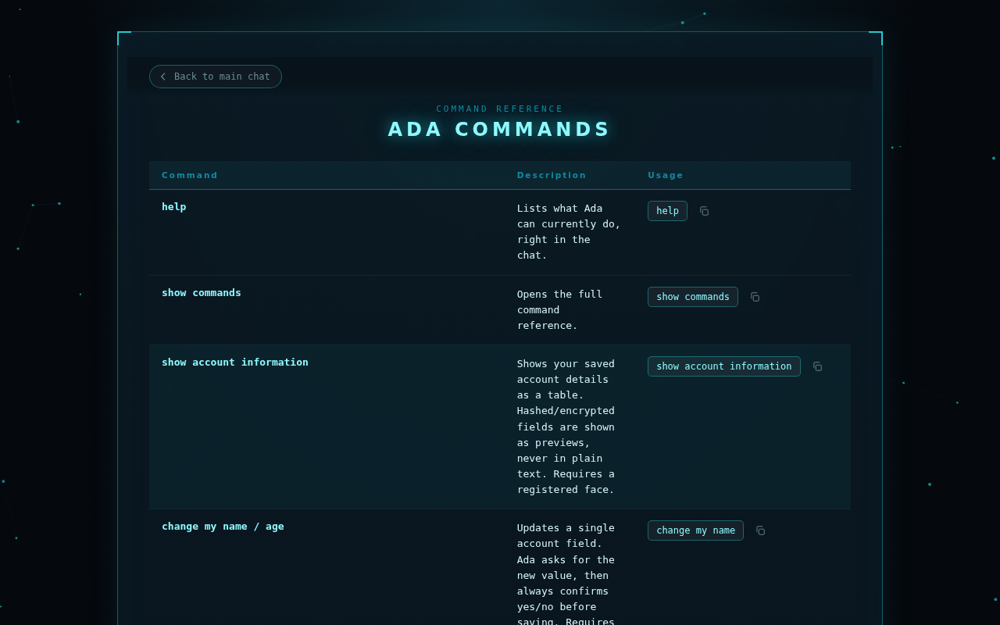
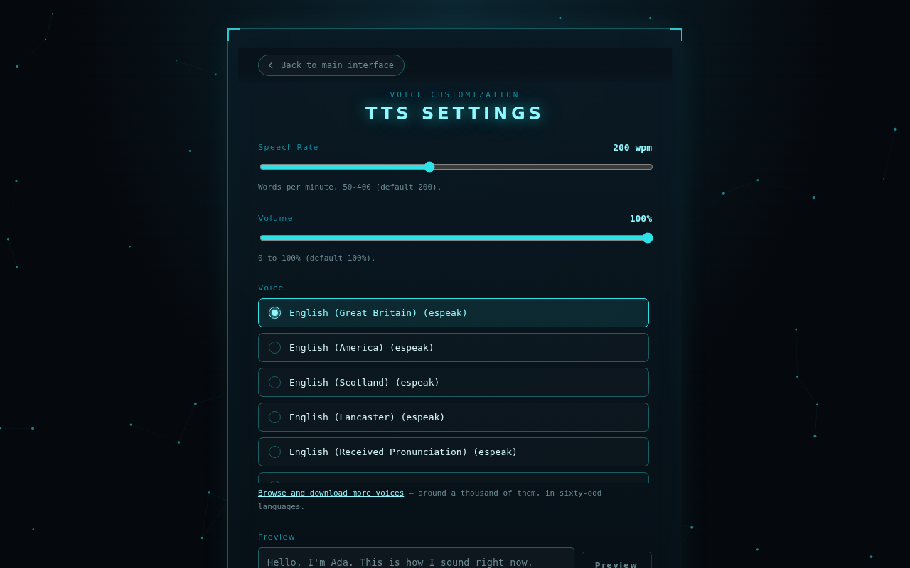
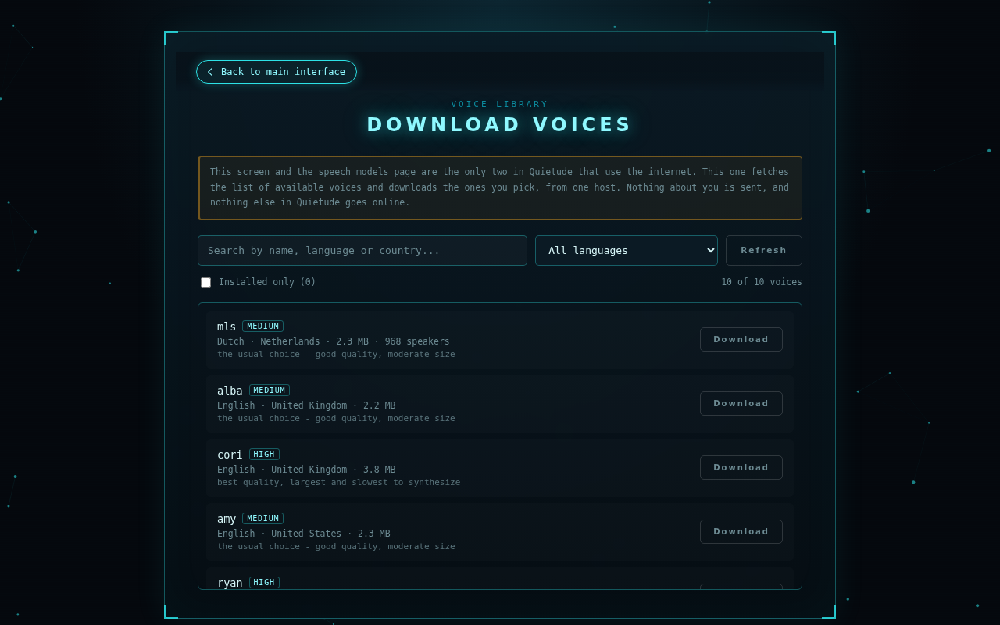
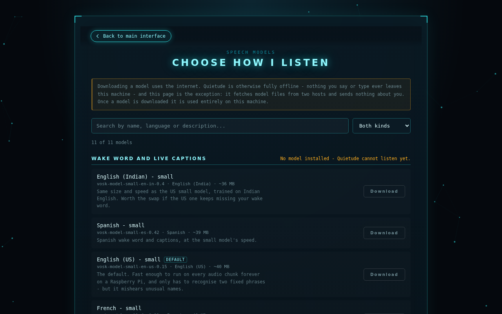

<div align="center">


# Quietude

**Nothing leaves this room.**


A personal assistant for Linux that runs entirely on your own computer.
You give it a name. It listens, talks back, and nothing you say goes
anywhere.

[Install](#install-it) · [First run](#your-first-five-minutes) ·
[Everything you can say](#everything-you-can-say) ·
[Settings](#making-it-yours) · [If something goes wrong](#if-something-goes-wrong)

</div>

---

## What this is

Most assistants send your voice to a company's servers. This one doesn't.
Everything happens on your machine: it hears you with a speech model
sitting on your hard drive, answers with a voice synthesised on your
processor, and recognises your face with a camera that never uploads a
frame.

It opens in its own window, like any other desktop application. Once
you've named it, that name is what you see everywhere — the title bar,
every reply, the command list. "Quietude" is only the name of the
program.



**The assistant is yours to define.** It has no name until you give it
one. Pick the name, the pronouns, the age, the nationality — and the
name you choose becomes the words you say to wake it up.

Everything you set here applies as you type it. Rename it and every
message already on screen relabels itself, the window title changes, and
the command reference rewrites — there's nothing to save and nothing to
restart.



---

## Before you start

You need a computer running Linux. That's mostly it. The installer
handles the rest.

| | |
|---|---|
| **Operating system** | Any mainstream Linux — Ubuntu, Debian, Fedora, Arch, openSUSE, Alpine |
| **Disk space** | About 2 GB |
| **Memory** | 4 GB is comfortable |
| **Internet** | Needed once, to download. Not needed after that |
| **A microphone** | Only if you want to talk to it. Typing works without one |
| **A webcam** | Only if you want to log in with your face. A password works without one |

You do **not** need Docker, a server, a cloud account, or an API key.

---

## Install it

Open a terminal and run these three lines:

```bash
git clone https://github.com/a-khavish/quietude.git
cd quietude
./install.sh
```

The installer will ask for your password once, to install a handful of
system packages. Then it downloads the speech models — about 250 MB —
and sets everything up. It takes a few minutes on a normal connection.

When it finishes, start it:

```bash
quietude
```

You'll also find **Quietude** in your applications menu, with its own
icon, like any other program.

<details>
<summary><b>If the <code>quietude</code> command isn't found</b></summary>

Your shell doesn't know about `~/.local/bin` yet. Add it:

```bash
echo 'export PATH="$HOME/.local/bin:$PATH"' >> ~/.bashrc
source ~/.bashrc
```

If you use zsh, use `~/.zshrc` instead of `~/.bashrc`.

</details>

<details>
<summary><b>Installing without the speech models (faster)</b></summary>

```bash
./install.sh --no-models
```

Typing works straight away. You can download the models later from
inside the app — just type `speech models`.

</details>

<details>
<summary><b>Other install options</b></summary>

| Option | What it does |
|---|---|
| `--no-models` | Skip the speech models. Typing works; talking doesn't, yet |
| `--no-fonts` | Skip the two web fonts and use your system's |
| `--no-system-deps` | Don't touch your package manager. It prints what it needs so you can install it yourself |
| `--no-service` | Don't add the menu entry or the background service |
| `--models-only` | Download the models into an existing install |
| `--desktop-only` | Just refresh the icon and the menu entry |
| `--doctor` | Check what's working and print a report. Changes nothing |
| `--uninstall` | Remove the program. **Your profile and models are kept** |
| `--purge-data` | Used with `--uninstall`, also erases your profile. This cannot be undone |

</details>

---

## Your first five minutes

### 1. Read and agree

The first screen tells you what runs where, and what the one exception
is. It's short, and worth reading.



### 2. Tell it about you

It asks for your name, your age, and a backup password. The password is
your way in if the camera ever doesn't cooperate — bad lighting, a
broken webcam, or you just don't feel like showing your face.

### 3. Give it a name



This is the fun part, and the one choice worth thinking about for a
second.

**The name you pick becomes the wake word.** Call it Ada, and you get
its attention by saying *"Hello Ada"*. `hey`, `ok` and `hi` work too.

One thing to know: the model that listens for the wake word only knows
real words. It isn't sounding things out letter by letter — it's picking
from a list of words it was trained on. So an invented name can't be
recognised, no matter how clearly you say it.

You don't have to guess. The app checks the name against the model's own
word list as you type it, and tells you straight away:

> ⚠ The wake-word model doesn't know "Zyx", so it will never hear it as a
> wake word. Everything else will still use the name — it's only the wake
> word that needs a word the model knows.

Common names work. If you want something unusual, you can still use it —
just type to it instead of talking, or pick a nickname it can hear.

### 4. Register your face (optional)

If you have a webcam, it'll offer to set up face login. Say no if you'd
rather not — you can always do it later by typing `register face`.

### 5. Say hello

That's it. Type `help` to see what it can do.

---

## Everything you can say

Type it, or say it out loud once voice chat is on. The important ones
are also listed down the left-hand side of the window — just click one.

| Say this | And it will |
|---|---|
| `help` | List what it can do, right there in the chat |
| `show commands` | Open the full reference |
| `what time is it` | Tell you the time. Also `what's the date` |
| `who are you` | Open its own settings — name, pronouns, age, nationality |
| `turn on voice chat` | Start listening. Say the wake word to get its attention |
| `turn off voice chat` | Stop listening |
| `tts settings` | Change the voice, the speed and the volume |
| `voice library` | Browse and download different voices |
| `speech models` | Change or upgrade what it listens with |
| `register face` | Set up or update face login |
| `show account information` | Show your saved details |
| `change my name` | Update one of your details. It always confirms first |
| `show features` | List every part of the app and whether anything leaves your machine |
| `clear terminal` | Wipe the conversation from the screen |
| `reset data` | Erase everything and start fresh. It asks twice |
| `shutdown` | Close it properly |



A few of these — changing your details, resetting your data, saving an
API key — need your face registered first. It'll tell you if so, and
offer to set it up there and then.

---

## Talking to it

Type `turn on voice chat`.

From then on it's listening, but not paying attention. That's two
different things, and the difference matters:

| | |
|---|---|
| **Asleep** | It hears sound, but nothing is acted on. The box shows what it's picking up, blurred and in red |
| **Awake** | You said the wake word. Now it's taking a command. Text turns green and sharp |

Say **"Hello Ada"** (or whatever you named it) to wake it, then say what
you want. Your words appear as you speak them. When you stop talking, it
takes a moment and replaces them with a more accurate transcription —
one model is fast, the other is careful, and you get both.

To interrupt it while it's speaking, say **"stop talking"**.

---

## Making it yours

### Who it is

Type `who are you`. Change the name, the pronouns, the age, the
nationality.

**Everything saves as you type it.** There's no Save button to press and
nothing to leave half-applied. Rename it and watch every message already
on screen relabel itself, the window title change, and the command
reference rewrite — right away.

The name changes what it says about itself and what it listens for. It
doesn't touch your account, your files, or anything on disk.

### How it sounds



Type `tts settings` for speed, volume and voice. Type a sentence into the
preview box and press Preview to hear exactly how it'll sound — using the
settings on screen, not the saved ones, so you can hear a change before
you commit to it.

Want a different voice entirely? Type `voice library`.



There are around a thousand voices across sixty-odd languages. Search by
name or language, see what each one costs in megabytes, download the ones
you like. A new voice is ready to use immediately — no restart.

### What it hears with



Type `speech models`. There are two, doing different jobs:

- One **listens for the wake word** and shows your words as you speak
- One **works out what you actually said**, once you've finished saying it

Both start small and both can be upgraded. Bigger models hear more and
take longer. If it's struggling to hear you, a bigger model is one answer
— but try the sensitivity slider first, it's usually enough.

---

## Where your things are kept

Nothing lives in the folder you downloaded. Your things are kept
separately, so updating the program never touches them:

| Folder | What's in it |
|---|---|
| `~/.local/share/quietude/` | Your profile, your face model, your downloaded voices and speech models |
| `~/.config/quietude/` | Window size and port settings. Nothing private |
| `~/.cache/quietude/` | Temporary audio clips. Safe to delete any time |

Your password is hashed, not stored. Your API key — if you ever set one —
is encrypted with a key generated on your machine at install time.

---

## About privacy

This is the point of the whole thing, so it deserves to be precise
rather than reassuring.

**Runs entirely on your machine:**

- Hearing you — the speech models are files on your disk
- Speaking — the voice is synthesised on your processor
- Recognising your face — the camera feed never leaves the browser
- Your profile, your settings, your conversation

**Needs the internet, and tells you so on the screen that uses it:**

- The **voice library**, to list and download voices
- The **speech models** page, for the same reason

Both download files. Neither sends anything about you.

**The one real exception** is *conversation mode*. It's off by default,
it needs an API key you have to go and get yourself, and turning it on
sends what you type to Google. The app says so every single time you turn
it on. Leave it off and nothing you say ever leaves the machine.

You can check all of this yourself at any time — type `show features` and
it lists every part of the app, what it uses, and whether anything
leaves. It reads the live state; it isn't a list someone typed out once.

It listens on `127.0.0.1` only, which means your own machine and nothing
else. Other devices on your network cannot reach it.

---

## If something goes wrong

### It can't hear me

Try these in order:

1. **Check the microphone is picking you up.** The input box shows what
   it's hearing when voice chat is on. If nothing appears, your browser
   or system isn't passing it audio.
2. **Turn up the sensitivity.** Type `speech models` and move the
   sensitivity slider up. It applies immediately — talk while you move
   it.
3. **Check your name is one the model knows.** Type `who are you`. If
   there's a warning under the name, that's your problem — the wake word
   will never fire.
4. **Try a bigger model.** Type `speech models` and download a larger
   one. It's a bigger download, and more accurate.

### The icon is wrong in my dock

```bash
./install.sh --desktop-only
```

Then, if your desktop is still showing the old one, it's holding a cached
copy:

- **GNOME on X11** — press <kbd>Alt</kbd>+<kbd>F2</kbd>, type `r`, press Enter
- **GNOME on Wayland** — log out and back in
- **KDE** — run `plasmashell --replace &`
- **Anything else** — log out and back in

### Something else

```bash
./install.sh --doctor
```

This prints what your desktop can actually see, what's installed, what's
missing and what version of everything you have. It changes nothing. If
you're reporting a problem, paste that output — it answers most of the
questions I'd otherwise have to ask.

### Starting over

```bash
./install.sh --uninstall
```

This removes the program and keeps your profile and your downloaded
models. If you want those gone too:

```bash
./install.sh --uninstall --purge-data
```

That one cannot be undone.

---

## For developers

The [technical write-up](docs/how-it-works.md) covers the architecture,
the design decisions, and the measurements behind them in detail.

The short version: a Python backend (Flask, serving JSON only), a Vue 3
single-page frontend, and a GTK window with a WebKit view in it. Speech
recognition is Vosk for the wake word and faster-whisper for
transcription. Speech synthesis is piper, with espeak-ng as a fallback.
Face recognition is OpenCV. Each of the heavy parts runs in its own
process, so one of them wedging can't take the rest down.

```bash
# the backend on its own, no window
~/.local/share/quietude/venv/bin/python -m quietude --window none

# the frontend with hot reload, in a second terminal
cd frontend && npm run dev
```

The backend is installed in editable mode, so changes under `backend/`
take effect the next time you start it. The dev server proxies the API
across, so `npm run dev` gives you the real backend with a live frontend.

Pull requests are welcome. If you're adding a command, there's one list
to add it to — `COMMANDS_REFERENCE` in `backend/quietude/core/assistant.py`
— and the reference page, the sidebar and the help text all pick it up.

---

## Licence

**GNU General Public License v3.0 or later.**

Copyright © 2026 Khavish Auckaloo. The full text is in
[LICENSE](LICENSE).

In plain terms:

- **You can** use it, study it, change it, and share it — privately or
  publicly, for free or for money.
- **If you share a changed version**, you have to share your changes
  too, under this same licence, and say what you changed.
- **There is no warranty.** If it breaks something, that's on you.

The point of choosing this licence rather than a permissive one is that
a program whose whole purpose is keeping your data on your own machine
shouldn't be able to be taken, closed up, and shipped back to you with
that taken out.
